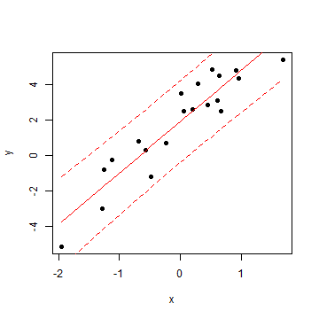
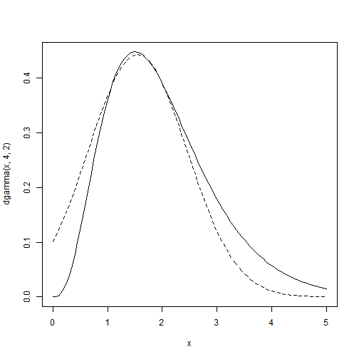

The Bayesian way
========================================================

Petr Keil

June 2021

Are we interested in the data, or the model, or the parameters?
========================================================

$y_i \sim Normal(\mu_i, \sigma)$

$\mu_i = a + b \times x_i$ 

Conditional probability
========================================================
Rule for joint (AND) probability is
$$P(A \cap B) = P(A) \times P(B|A)$$
$A$ and $B$ can be swapped arbitrarily
$$P(A \cap B) = P(B) \times P(A|B)$$
and so
$$P(B) \times P(A|B) = P(A) \times P(B|A)$$
which we can rearrange to get
$$P(A|B) = \frac {P(A) \times P(B|A)}{P(B)}$$
which is **the Bayes rule**.

Bayes rule in statistics
========================================================
We can replace $A$ and $B$ by **model parameters** $\theta$ and the **data** $y$ to get 

$p(\theta|y) = \frac {p(\theta) \times p(y|\theta)}{p(y)}$

where

$p(y|\theta)$ ... likelihood

$p(\theta)$ ... prior

$p(\theta|y)$ ... posterior

$p(y)$ ... the horrible thing

Why is p(y) horrible?
========================================================
$$p(y)=\sum_\theta p(\theta) \times p(y|\theta)$$

$$p(y)=\int_\theta p(\theta) \times p(y|\theta) d\theta$$

Avoiding the horrible thing
========================================================

In most cases we can't calculate $p(y)$. But we can calculate the ratio of $p(\theta_1|y)$ and  $p(\theta_2|y)$:

$$\frac{p(\theta_1|y) }{ p(\theta_2|y)}=\frac{p(\theta_1) \times p(y|\theta_1)}{p(\theta_2) \times p(y|\theta_2)} = \alpha$$

We can also say that 

$$p(\theta|y) \propto p(\theta) \times p(y|\theta) $$

Sampling from the posterior
========================================================

We can use the ratio $\frac{p(\theta_1|y) }{ p(\theta_2|y)}$ to sample from the posterior distribution by a numerical sampling algorithm called Markov Chain Monte Carlo (**MCMC**).
- **Metropolis-Hastings algorithm** -- Seeh
[YouTube video](https://www.youtube.com/watch?v=OTO1DygELpY&list=RDQMWKs1u7BRg1w&start_radio=1).
- **Gibbs algorithm**

Sampling from the posterior
========================================================
The result of three Markov chains running on the 3D Rosenbrock function using the Metropolis-Hastings algorithm. (Source: [Wikipedia article](http://en.wikipedia.org/wiki/Metropolis%E2%80%93Hastings_algorithm)).

To summarize, we only need
========================================================

$$p(\theta|y) \propto p(\theta) \times p(y|\theta) $$

and not 

$$p(\theta|y) = \frac {p(\theta) \times p(y|\theta)}{p(y)}$$

Common MCMC samplers
========================================================
**WinBUGS, OpenBUGS** [www.openbugs.net](http://openbugs.net/w/FrontPage) -- uses BUGS language

**JAGS** [mcmc-jags.sourceforge.net/](http://mcmc-jags.sourceforge.net/) -- uses BUGS language

**STAN** - [mc-stan.org](mc-stan.org)

STAN - properties
=======================================================
[mc-stan.org](mc-stan.org)
 
 - uses more sophisticated MCMC sampling than Gibbs or M-H
 
 - suffers less from steps autocorrelation
 
 - may be more efficient for complicated posteriors (cigars, camels)
 
 - language is more difficult to command then BUGS

INLA
========================================================
(Integrated Nested Laplace Approximation)

[www.r-inla.org](www.r-inla.org)

Uses the idea that in certain types of models $p(\theta_a|\theta_b, y)$ can be aproximated by normal distribution (note: $\theta_a$ and $\theta_b$ are two different parameters in the same model).

This makes the expression $p(y|\theta) \times p(\theta)$ integrable.

INLA
========================================================

INLA - properties
========================================================
 - It is fast.
 
 - Does not suffer from sampling issues.
 
 - Applicable only to some classes of models (for details see [http://www.r-inla.org/models/latent-models](http://www.r-inla.org/models/latent-models)).
