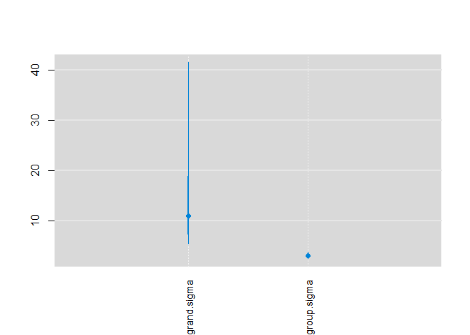
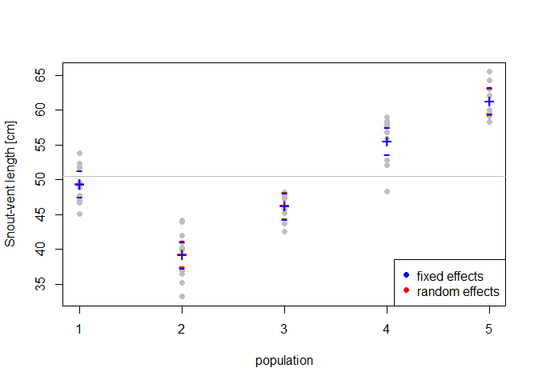

***

# Objective

The aim of this lesson is to leave the participants to come up with their
code for simple one-way ANOVA (part 1), and to experiment with random effects ANOVA (part 2).

***

# The Data

We will use modified data from the example from **Marc Kery's Introduction to WinBUGS for Ecologists**, page 119 (Chapter 9 - ANOVA). The data describe snout-vent lengths in 5 populations of Smooth snake (*Coronella austriaca*).


***

Loading the data from the web:


```r
  snakes <- read.csv("https://raw.githubusercontent.com/petrkeil/ML_and_Bayes_2021_CZU/main/09_ANOVA/snakes.csv")

  summary(snakes)
```

```
##    population   snout.vent   
##  Min.   :1    Min.   :33.19  
##  1st Qu.:2    1st Qu.:45.11  
##  Median :3    Median :48.56  
##  Mean   :3    Mean   :50.45  
##  3rd Qu.:4    3rd Qu.:58.09  
##  Max.   :5    Max.   :65.49
```

Plotting the data:

```r
  par(mfrow=c(1,2))
  plot(snout.vent ~ population, data=snakes,
       ylab="Snout-vent length [cm]")
  boxplot(snout.vent ~ population, data=snakes,
          ylab="Snout-vent length [cm]",
          xlab="population",
          col="grey")
```

<!-- -->

***

# Fixed-effects ANOVA in JAGS

For a given snake $i$ in population $j$ **the model** can be written as:

$y_{ij} \sim Normal(\alpha_j, \sigma)$

Here is how we prepare the data:

```r
  snake.data <- list(y=snakes$snout.vent,
                     x=snakes$population,
                     N=nrow(snakes), 
                     N.pop=5)
```

Loading the library that communicates with JAGS


```r
  library(R2jags)
```

JAGS Model definition:


```r
cat("
  model
  {
    # priors
    sigma ~ dunif(0,100)
    tau <- 1/(sigma*sigma)
    for(j in 1:N.pop)
    {
      alpha[j] ~ dnorm(0, 0.001)
    }
  
    # likelihood
    for(i in 1:N)
    {
      y[i] ~ dnorm(alpha[x[i]], tau)
    }

    # derived quantity
    delta12 <- alpha[1] - alpha[2]
  }
", file="fixed_anova.txt")
```

And we will fit the model:


```r
model.fit.fix <- jags(data=snake.data, 
                        model.file="fixed_anova.txt",
                        parameters.to.save=c("alpha", "delta12"),
                        n.chains=3,
                        n.iter=2000,
                        n.burnin=1000,
                        DIC=FALSE)
```

```
## module glm loaded
```

```
## module dic loaded
```

```
## Compiling model graph
##    Resolving undeclared variables
##    Allocating nodes
## Graph information:
##    Observed stochastic nodes: 50
##    Unobserved stochastic nodes: 6
##    Total graph size: 115
## 
## Initializing model
```

```r
model.fit.fix
```

```
## Inference for Bugs model at "fixed_anova.txt", fit using jags,
##  3 chains, each with 2000 iterations (first 1000 discarded)
##  n.sims = 3000 iterations saved
##          mu.vect sd.vect   2.5%    25%    50%    75%  97.5%  Rhat n.eff
## alpha[1]  49.420   0.966 47.507 48.768 49.428 50.059 51.311 1.001  3000
## alpha[2]  39.238   0.971 37.326 38.594 39.221 39.898 41.098 1.001  3000
## alpha[3]  46.260   0.969 44.324 45.610 46.266 46.911 48.174 1.001  3000
## alpha[4]  55.651   0.978 53.695 55.000 55.646 56.321 57.540 1.001  3000
## alpha[5]  61.389   0.953 59.497 60.765 61.392 62.011 63.251 1.001  3000
## delta12   10.182   1.383  7.556  9.223 10.172 11.130 12.888 1.001  3000
## 
## For each parameter, n.eff is a crude measure of effective sample size,
## and Rhat is the potential scale reduction factor (at convergence, Rhat=1).
```

Plotting parameter estimates with `mcmcplots`


```r
library(mcmcplots)
```

```
## Warning: package 'mcmcplots' was built under R version 4.0.5
```

```
## Registered S3 method overwritten by 'mcmcplots':
##   method        from  
##   as.mcmc.rjags R2jags
```

```r
caterplot(model.fit.fix, parms="alpha", horizontal=FALSE, reorder=FALSE)
```

<!-- -->

Is there a difference between population 1 and 2?


```r
caterplot(model.fit.fix, parms="delta12", horizontal=FALSE, reorder=FALSE)
```

<!-- -->

***

# Random-effects ANOVA in JAGS

For a given snake $i$ in population $j$ **the model** can be written in a similar way as for the fixed-effects ANOVA above:

$y_{ij} \sim Normal(\alpha_j, \sigma)$

But now we will also add a **random effect**:

$\alpha_j \sim Normal(\mu_{grand}, \sigma_{grand})$

In short, a **random effect means that the parameters itself come from (are outcomes of) a given distribution**, here it is the Normal.

***

The data stay the same as in the fixed-effect example above.

Loading the library that communicates with JAGS

```r
  library(R2jags)
```

JAGS Model definition:

```r
cat("
  model
  {
    # priors
    grand.mean ~ dnorm(0, 0.001)
    grand.sigma ~ dunif(0,100)
    grand.tau <- 1/(grand.sigma*grand.sigma)
    group.sigma ~ dunif(0, 100)
    group.tau <- 1/(group.sigma*group.sigma)
  
    for(j in 1:N.pop)
    {
      alpha[j] ~ dnorm(grand.mean, grand.tau)
    }
  
    # likelihood
    for(i in 1:N)
    {
      y[i] ~ dnorm(alpha[x[i]], group.tau)
    }

    # derived quantity
    delta12 <- alpha[1] - alpha[2]
  }
", file="random_anova.txt")
```

And we will fit the model:


```r
model.fit.rnd <- jags(data=snake.data, 
               model.file="random_anova.txt",
               parameters.to.save=c("alpha", "grand.sigma", "group.sigma"),
               n.chains=3,
               n.iter=2000,
               n.burnin=1000,
               DIC=FALSE)
```

```
## Compiling model graph
##    Resolving undeclared variables
##    Allocating nodes
## Graph information:
##    Observed stochastic nodes: 50
##    Unobserved stochastic nodes: 8
##    Total graph size: 119
## 
## Initializing model
```

```r
model.fit.rnd
```

```
## Inference for Bugs model at "random_anova.txt", fit using jags,
##  3 chains, each with 2000 iterations (first 1000 discarded)
##  n.sims = 3000 iterations saved
##             mu.vect sd.vect   2.5%    25%    50%    75%  97.5%  Rhat n.eff
## alpha[1]     49.485   0.963 47.588 48.834 49.487 50.136 51.378 1.001  3000
## alpha[2]     39.372   0.952 37.551 38.729 39.370 40.023 41.247 1.002  1100
## alpha[3]     46.352   0.989 44.396 45.705 46.363 47.021 48.223 1.001  2300
## alpha[4]     55.628   0.981 53.656 55.004 55.645 56.264 57.570 1.001  3000
## alpha[5]     61.334   0.982 59.368 60.708 61.347 62.001 63.242 1.001  3000
## grand.sigma  13.827  10.303  5.383  8.295 11.010 15.530 41.403 1.013   250
## group.sigma   3.050   0.341  2.476  2.820  3.018  3.241  3.809 1.001  2400
## 
## For each parameter, n.eff is a crude measure of effective sample size,
## and Rhat is the potential scale reduction factor (at convergence, Rhat=1).
```

Plotting parameter estimates with `mcmcplots`


```r
library(mcmcplots)

caterplot(model.fit.rnd, parms="alpha", horizontal=FALSE, reorder=FALSE)
```

<!-- -->

```r
caterplot(model.fit.rnd, parms=c("grand.sigma", "group.sigma"), horizontal=FALSE)
```

<!-- -->


# Plotting the posteriors from both models

Let's extract the medians posterior distributions of the expected values of $\alpha_j$ and their 95% credible intervals:

```r
  rnd.alphas <- model.fit.rnd$BUGSoutput$summary
  fix.alphas <- model.fit.fix$BUGSoutput$summary
  
  plot(snout.vent ~ population, data=snakes,
       ylab="Snout-vent length [cm]", col="grey", pch=19)
  points(rnd.alphas[,'2.5%'], col="red", pch="-", cex=1.5)
  points(fix.alphas[,'2.5%'], col="blue", pch="-", cex=1.5) 
  points(rnd.alphas[,'97.5%'], col="red", pch="-", cex=1.5)
  points(fix.alphas[,'97.5%'], col="blue", pch="-", cex=1.5) 
  points(rnd.alphas[,'50%'], col="red", pch="+", cex=1.5)
  points(fix.alphas[,'50%'], col="blue", pch="+", cex=1.5) 

  abline(h=mean(snakes$snout.vent), col="grey")
  legend("bottomright", pch=c(19,19), col=c("blue","red"),
         legend=c("fixed effects","random effects"))
```

<!-- -->

***


