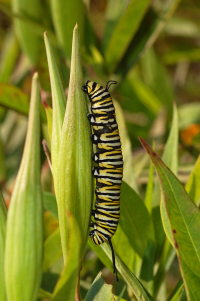

***

# Objectives

Here we will do classical linear regression in both frequentist and Bayesian setting. We will also show the difference between **credible intervals** and  **prediction intervals**.

In **Part 1** the data and the model are introduced and the traditional frequentist aproaches are described. Participants then try to implement the model in BUGS. In **Part 2** the solution is exposed, and the difference between credible and prediction intervals is explained.


***

# The data

We will use data from **Michael Crawley's R Book**, Chapter 10 (Linear Regression). The data show the growth of catepillars fed on experimental diets differing in their tannin contnent.




***

To **load the data** to R directly from the web:

```{r}
  catepil <- read.csv("https://rawgit.com/petrkeil/ML_and_Bayes_2017_iDiv/master/Linear%20Regression/catepilar_data.csv")
  catepil
```

The data look like this:

```{r, fig.width=4, fig.height=4}
  plot(growth~tannin, data=catepil, pch=19)
```

***

# The model

The classical notation:
$$ growth_i = a + b \times tannin_i + \epsilon_i  $$
$$ \epsilon_i \sim N(0, \sigma)$$


**The notation that we will use**:

$$ \mu_i = a + b \times tannin_i $$
$$ growth_i \sim N(\mu_i, \sigma) $$

These notations are mathematically equivalent, 
but the second notation shows more directly 
how we think about the stochastic part of the model. It is also more broadly used
in the fields of hierarchical modelling and Bayesian analysis.

***

This is how Kurschke plots it (Kruschke (2014) *Doing Bayesian Data Analysis*, 2nd edition, Academic Press / Elsevier):


***

# Linear regression manually

This will work **for those with R-studio only**!

```{r}
source("https://rawgit.com/petrkeil/ML_and_Bayes_2017_iDiv/master/Linear Regression/linear_regression_part0_functions.r")
```


```{r, eval=FALSE}
manipulate(
  regr.plot(x=catepil$tannin, y=catepil$growth, a, b, sigma),
  a = slider(min=0, max=15, step=0.01, initial=5),
  b = slider(min=-5, max=5, step=0.01, initial=-2),
  sigma = slider(min=0, max=3, step=0.01, initial=0.1)
)
```

***

# Linear regression fitted with MLE and `optim`

First we will define function returning value that we will **optimize** (i.e. **minimize**):

```{r}
neg.LL.function.for.optim <- function(par, dat)
{
  tannin <- dat$tannin
  growth <- dat$growth
  a <- par[1]
  b <- par[2]
  sigma <- par[3]
  
  # likelihood
  mu <- a + b*tannin
  L <- dnorm(growth, mean=mu, sd=sigma)
  
  # negative log-likelihood
  neg.LL <- - sum(log(L))
  return(neg.LL)
}
```

And here we use `optim` to do the actual optimization. Note: For 1-dimensional problems
you can use `optimize`, or `uniroot`.

```{r}
optim(par=c(a=0, b=0, sigma=1), 
      fn=neg.LL.function.for.optim, 
      dat=catepil)
```

***

# Linear regression using `glm`

```{r}
  model.lm <- glm(growth~tannin, data=catepil)
```

```{r, fig.width=4, fig.height=4}
  plot(growth~tannin, data=catepil, pch=19)
  abline(model.lm)
  summary(model.lm)
```

And how about the $\sigma$?

```{r}

```


***

# Tasks for you

Using the ideas from previous lessons:

- Try to **prepare the `catepil` data** for this model in the `list` format.

- Try to write the regression **model in the JAGS language** and dump it into a file using `cat`.

- Try to fit the model in JAGS and **estimate posterior distributions** of $a$ and $b$.


***


