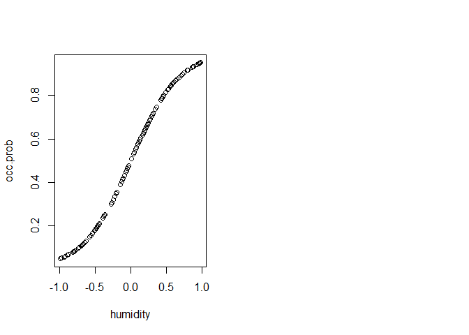

<!-- -->

***

# Objective

Here we will go through a simple hierarchical model of species occupancy that
accounts for imperfect detectability of a species. The main aims are (1) to show a variant of **binomial-family regression**, (2) to demonstrate
hierarchical models with **observation and process components**, and (3) to introduce
the concept of **latent variables**.

***

# The Data

We will work with **Marc Kery's data from chapter 20** of his Introduction to WinBUGS for ecologists.
The data describe detections of *Gentianella germanica* at 150 sites, each visited 3 times. We wish to estimate the relationship between $P$ of occurence, and a humidity index. However, we also know that the detectability of the species depends on humidity itself.


Loading the data from the web:

```r
  gentiana <- read.csv("http://www.petrkeil.com/wp-content/uploads/2014/02/gentiana.csv")
  gentiana <- gentiana[,-1]
```

Explore the data a little bit:

```r
head(gentiana)
```

```
## data frame with 0 columns and 6 rows
```

```r
nrow(gentiana)
```

```
## [1] 255
```

***

# "Naive" analysis by GLM

This is the classical LOGISTIC REGRESSION for presence-absence data:

```r
  naive.m1 <- glm(pres.abs~humidity, data=gentiana, family="binomial")
```

Or the response can be number of successes out of 3 visits:


