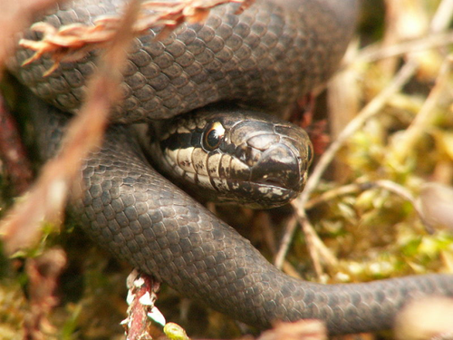
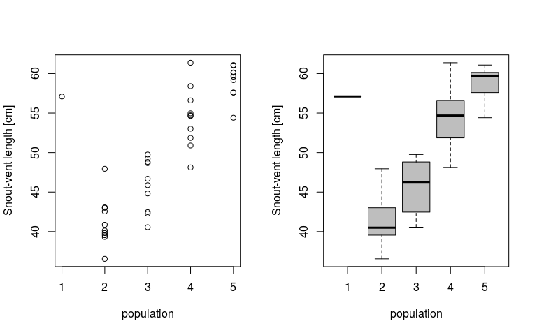

# ANOVA -- **part 1**: The data and fixed-effects model definition
Petr Keil  
March 2017  

***

# Objective

The aim of this lesson is to leave the participants to come up with their
code for simple one-way ANOVA (part 1), and to experiment with random effects ANOVA (part 2).

***

# The Data

We will use modified data from the example from **Marc Kery's Introduction to WinBUGS for Ecologists**, page 119 (Chapter 9 - ANOVA). The data describe snout-vent lengths in 5 populations of Smooth snake (*Coronella austriaca*).



***

Loading the data from the web:


```r
  snakes <- read.csv("http://www.petrkeil.com/wp-content/uploads/2017/02/snakes_lengths.csv")

  summary(snakes)
```

```
##    population      snout.vent   
##  Min.   :1.000   Min.   :36.56  
##  1st Qu.:2.000   1st Qu.:43.02  
##  Median :3.000   Median :49.76  
##  Mean   :3.439   Mean   :50.35  
##  3rd Qu.:4.000   3rd Qu.:57.60  
##  Max.   :5.000   Max.   :61.37
```

Plotting the data:

```r
  par(mfrow=c(1,2))
  plot(snout.vent ~ population, data=snakes,
       ylab="Snout-vent length [cm]")
  boxplot(snout.vent ~ population, data=snakes,
          ylab="Snout-vent length [cm]",
          xlab="population",
          col="grey")
```

<!-- -->

***

# The model: Fixed-effects ANOVA

For a given snake $i$ in population $j$ **the model** can be written as:

$y_{ij} \sim Normal(\alpha_j, \sigma)$

***

# Tasks for you:

* Write this model in the BUGS language and dump it into a file
using `cat`.

* Pepare the data for this model to the `list` format.

* Fit the model and estimate posterior distributions of $\alpha_j$.

* Is there a significant difference of mean snout-vent length between 
populations 1 and 2?


