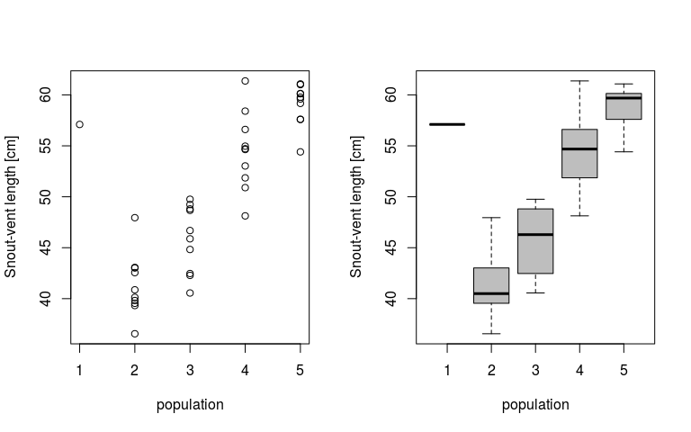

# ANOVA -- **part 2**: Fixed and random effects in JAGS
Petr Keil  
March 2017  

***

# Objective

The aim of this lesson is to leave the participants to come up with their
code for simple one-way ANOVA (part 1), and to experiment with random effects ANOVA (part 2).

***

# The Data

We will use modified data from the example from **Marc Kery's Introduction to WinBUGS for Ecologists**, page 119 (Chapter 9 - ANOVA). The data describe snout-vent lengths in 5 populations of Smooth snake (*Coronella austriaca*).


***

Loading the data from the web:


```r
  snakes <- read.csv("http://www.petrkeil.com/wp-content/uploads/2017/02/snakes_lengths.csv")

  summary(snakes)
```

```
##    population      snout.vent   
##  Min.   :1.000   Min.   :36.56  
##  1st Qu.:2.000   1st Qu.:43.02  
##  Median :3.000   Median :49.76  
##  Mean   :3.439   Mean   :50.35  
##  3rd Qu.:4.000   3rd Qu.:57.60  
##  Max.   :5.000   Max.   :61.37
```

Plotting the data:

```r
  par(mfrow=c(1,2))
  plot(snout.vent ~ population, data=snakes,
       ylab="Snout-vent length [cm]")
  boxplot(snout.vent ~ population, data=snakes,
          ylab="Snout-vent length [cm]",
          xlab="population",
          col="grey")
```

<!-- -->

***

# Fixed-effects ANOVA in JAGS

For a given snake $i$ in population $j$ **the model** can be written as:

$y_{ij} \sim Normal(\alpha_j, \sigma)$

Here is how we prepare the data:

```r
  snake.data <- list(y=snakes$snout.vent,
                     x=snakes$population,
                     N=nrow(snakes), 
                     N.pop=5)
```

Loading the library that communicates with JAGS


```r
  library(R2jags)
```

JAGS Model definition:


```r
cat("
  model
  {
    # priors
    sigma ~ dunif(0,100)
    tau <- 1/(sigma*sigma)
    for(j in 1:N.pop)
    {
      alpha[j] ~ dnorm(0, 0.001)
    }
  
    # likelihood
    for(i in 1:N)
    {
      y[i] ~ dnorm(alpha[x[i]], tau)
    }

    # derived quantity
    delta12 <- alpha[1] - alpha[2]
  }
", file="fixed_anova.txt")
```

And we will fit the model:


```r
model.fit.fix <- jags(data=snake.data, 
                        model.file="fixed_anova.txt",
                        parameters.to.save=c("alpha", "delta12"),
                        n.chains=3,
                        n.iter=2000,
                        n.burnin=1000,
                        DIC=FALSE)
```

```
## module glm loaded
```

```
## module dic loaded
```

```
## Compiling model graph
##    Resolving undeclared variables
##    Allocating nodes
## Graph information:
##    Observed stochastic nodes: 41
##    Unobserved stochastic nodes: 6
##    Total graph size: 107
## 
## Initializing model
```

```r
model.fit.fix
```

```
## Inference for Bugs model at "fixed_anova.txt", fit using jags,
##  3 chains, each with 2000 iterations (first 1000 discarded)
##  n.sims = 3000 iterations saved
##          mu.vect sd.vect   2.5%    25%    50%    75%  97.5%  Rhat n.eff
## alpha[1]  56.515   3.272 49.989 54.314 56.546 58.697 62.820 1.001  3000
## alpha[2]  41.218   1.039 39.150 40.549 41.223 41.907 43.271 1.001  3000
## alpha[3]  45.865   1.035 43.808 45.174 45.882 46.561 47.947 1.001  2500
## alpha[4]  54.416   1.049 52.263 53.743 54.416 55.140 56.446 1.001  3000
## alpha[5]  58.956   1.041 56.940 58.273 58.957 59.651 61.003 1.001  3000
## delta12   15.297   3.429  8.538 13.094 15.343 17.543 21.964 1.001  3000
## 
## For each parameter, n.eff is a crude measure of effective sample size,
## and Rhat is the potential scale reduction factor (at convergence, Rhat=1).
```

Plotting parameter estimates with `mcmcplots`


```r
library(mcmcplots)

caterplot(model.fit.fix, parms="alpha", horizontal=FALSE, reorder=FALSE)
```

<!-- -->

Is there a difference between population 1 and 2?


```r
caterplot(model.fit.fix, parms="delta12", horizontal=FALSE, reorder=FALSE)
```

<!-- -->

***

# Random-effects ANOVA in JAGS

For a given snake $i$ in population $j$ **the model** can be written in a similar way as for the fixed-effects ANOVA above:

$y_{ij} \sim Normal(\alpha_j, \sigma)$

But now we will also add a **random effect**:

$\alpha_j \sim Normal(\mu_{grand}, \sigma_{grand})$

In short, a **random effect means that the parameters itself come from (are outcomes of) a given distribution**, here it is the Normal.

***

The data stay the same as in the fixed-effect example above.

Loading the library that communicates with JAGS

```r
  library(R2jags)
```

JAGS Model definition:

```r
cat("
  model
  {
    # priors
    grand.mean ~ dnorm(0, 0.001)
    grand.sigma ~ dunif(0,100)
    grand.tau <- 1/(grand.sigma*grand.sigma)
    group.sigma ~ dunif(0, 100)
    group.tau <- 1/(group.sigma*group.sigma)
  
    for(j in 1:N.pop)
    {
      alpha[j] ~ dnorm(grand.mean, grand.tau)
    }
  
    # likelihood
    for(i in 1:N)
    {
      y[i] ~ dnorm(alpha[x[i]], group.tau)
    }

    # derived quantity
    delta12 <- alpha[1] - alpha[2]
  }
", file="random_anova.txt")
```

And we will fit the model:


```r
model.fit.rnd <- jags(data=snake.data, 
               model.file="random_anova.txt",
               parameters.to.save=c("alpha", "grand.sigma", "group.sigma"),
               n.chains=3,
               n.iter=2000,
               n.burnin=1000,
               DIC=FALSE)
```

```
## Compiling model graph
##    Resolving undeclared variables
##    Allocating nodes
## Graph information:
##    Observed stochastic nodes: 41
##    Unobserved stochastic nodes: 8
##    Total graph size: 107
## 
## Initializing model
```

```r
model.fit.rnd
```

```
## Inference for Bugs model at "random_anova.txt", fit using jags,
##  3 chains, each with 2000 iterations (first 1000 discarded)
##  n.sims = 3000 iterations saved
##             mu.vect sd.vect   2.5%    25%    50%    75%  97.5%  Rhat n.eff
## alpha[1]     56.400   3.079 50.306 54.328 56.338 58.493 62.358 1.001  3000
## alpha[2]     41.431   1.030 39.429 40.717 41.430 42.123 43.450 1.001  2300
## alpha[3]     45.973   1.012 44.018 45.286 45.983 46.632 47.965 1.001  3000
## alpha[4]     54.418   1.031 52.340 53.731 54.422 55.118 56.331 1.001  3000
## alpha[5]     58.939   1.018 56.909 58.267 58.956 59.633 60.862 1.001  3000
## grand.sigma  12.184   8.254  4.842  7.489  9.947 13.896 34.483 1.014   730
## group.sigma   3.215   0.393  2.556  2.928  3.182  3.463  4.061 1.002  1900
## 
## For each parameter, n.eff is a crude measure of effective sample size,
## and Rhat is the potential scale reduction factor (at convergence, Rhat=1).
```

Plotting parameter estimates with `mcmcplots`


```r
library(mcmcplots)

caterplot(model.fit.rnd, parms="alpha", horizontal=FALSE, reorder=FALSE)
```

<!-- -->

```r
caterplot(model.fit.rnd, parms=c("grand.sigma", "group.sigma"), horizontal=FALSE)
```

<!-- -->


# Plotting the posteriors from both models

Let's extract the medians posterior distributions of the expected values of $\alpha_j$ and their 95% credible intervals:

```r
  rnd.alphas <- model.fit.rnd$BUGSoutput$summary
  fix.alphas <- model.fit.fix$BUGSoutput$summary
  
  plot(snout.vent ~ population, data=snakes,
       ylab="Snout-vent length [cm]", col="grey", pch=19)
  points(rnd.alphas[,'2.5%'], col="red", pch="-", cex=1.5)
  points(fix.alphas[,'2.5%'], col="blue", pch="-", cex=1.5) 
  points(rnd.alphas[,'97.5%'], col="red", pch="-", cex=1.5)
  points(fix.alphas[,'97.5%'], col="blue", pch="-", cex=1.5) 
  points(rnd.alphas[,'50%'], col="red", pch="+", cex=1.5)
  points(fix.alphas[,'50%'], col="blue", pch="+", cex=1.5) 

  abline(h=mean(snakes$snout.vent), col="grey")
  legend("bottomright", pch=c(19,19), col=c("blue","red"),
         legend=c("fixed effects","random effects"))
```

<!-- -->

***


