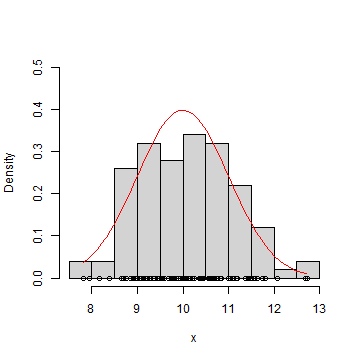

Intro to maximum likelihood and Bayesian statistics 
====================================

Petr Keil 

June 2021, FZP CZU


Preface
========================================================
- I am not a statistician.
- I will show the basics, you figure out the rest.
- Do ask questions and interrupt!

Preface
========================================================

It would be wonderful if, after the course, you would:
- Not be intimidated by Bayesian and ML papers.
- Get the foundations and some of useful connections between concepts to build on.
- See statistics as a simple construction set (e.g. Lego), rather than 
as a series of recipes.
- Have a statistical [satori](https://en.wikipedia.org/wiki/Satori).


Contents
========================================================
***DAY 1***
- Likelihood, probability distributions
- First Bayesian steps

***DAY 2***
- First Bayesian steps
- Classical models (regression, ANOVA)

***DAY 3***
- Advanced models (e.g. modelling imperfect species detection)
- Inference, uncertainty, model selection.


========================================================


*Statistical models are stories about how the data came to be.*

========================================================


*Parametric statistical modeling* means describing a caricature of the "machine" that plausibly could have produced the nubmers we observe.

Kéry 2010

Data
========================================================

```
             x          y
1  -2.87559866 -7.8153567
2  -2.13893841 -4.8626804
3  -1.71859225 -3.0267489
4  -1.26980103  0.9160898
5  -1.05830585  0.4116555
6  -0.88564131 -0.9385937
7  -0.77835122 -1.1697770
8  -0.55746435  0.9709515
9  -0.39814083  2.7044270
10 -0.32480481 -0.1098835
11 -0.32313844  1.8966363
12 -0.30080884  0.8523840
13  0.02069801  4.7909400
14  0.06725368  0.6451437
15  0.40741445  2.0080871
16  0.48307554  2.2515220
17  0.54376984  3.4859906
18  0.76605553  5.7904587
19  0.80853704  3.2641767
20  1.53494800  6.6093153
```

Data
========================================================


Data, model, parameters
========================================================


$y_i = a + b x_i + \epsilon_i$

$\epsilon_i \sim Normal(0, \sigma)$ 


Data, model, parameters
========================================================


$y_i \sim Normal(\mu_i, \sigma)$

$\mu_i = a + b x_i$ 


Data, model, parameters
========================================================


$y_i \sim Normal(\mu_i, \sigma)$

$\mu_i = a + b x_i$ 

**Deterministic** vs **stochastic** part. Also, $y_i$ is a random variable.

Data
========================================================


Data, model, parameters
========================================================


Can you separate the **deterministic** and the **stochastic** part?

$x_i \sim Normal(\mu, \sigma)$

Can you tell what is based on a parametric model?
========================================================
- Permutation tests
- Normal distribution
- Kruskall-Wallis test
- Histogram
- t-test
- Neural networks, random forests
- ANOVA
- Survival analysis
- Pearson correlation
- PCA (principal components analysis)


Elementary notation
========================================================
- $P(A)$ vs $p(A)$ ... Probability vs probability density
- $P(A \cap B)$ ... Joint (intersection) probability (AND)
- $P(A \cup B)$ ... Union probability (OR)
- $P(A|B)$ ... Conditional probability (GIVEN THAT)
- $\sim$ ... is distributed as
- $x \sim N(\mu, \sigma)$ ... x is a normally distributed **random variable**
- $\propto$ ... is proportional to (related by constant multiplication)

Elementary notation
========================================================
- $P(A)$ vs $p(A)$
- $P(A \cap B)$
- $P(A \cup B)$
- $P(A|B)$
- $\sim$ 
- $\propto$ 

Data, model, parameters
========================================================

Let's use $y$ for data, and $\theta$ for parameters.

$p(\theta | y, model)$ or $p(y | \theta, model)$ 

The model is always given (assumed), and usually omitted:

$p(y|\theta)$  ... "likelihood-based" or "frequentist" statistics 

$p(\theta|y)$ ... Bayesian statistics

Maximum Likelihood Estimation (MLE)
========================================================

- Used for most pre-packaged models (GLM, GLMM, GAM, ...)
- Great for complex models
- Relies on **optimization** (relatively fast)
- Can have problems with local optima
- Not great with uncertainty

Why go Bayesian?
========================================================
- Numerically tractable for models of any **complexity**.
- Unbiased for **small sample sizes**.
- It works with **uncertainty**.
- Extremely **simple inference**.
- The option of using **prior information**.
- It gives **perspective**.

The pitfalls
========================================================
- Steep learning curve.
- Tedious at many levels. 
- You will have to learn some programming.
- It can be computationally intensive, slow.
- Problematic model selection.
- Not an exploratory analysis or data mining tool.

To be thrown away
========================================================
- Null hypotheses formulation and testing
- P-values, significance at $\alpha=0.05$, ...
- Degrees of freedom, test statistics
- Post-hoc comparisons
- Sample size corrections

Remains
========================================================
- Regression, t-test, ANOVA, ANCOVA, MANOVA
- Generalized Linear Models (GLM)
- GAM, GLS, autoregressive models
- Mixed-effects (multilevel, hierarchical) models

Are hierarchical models always Bayesian?
=======================================================
- No

Myths about Bayes
========================================================
- It is a 'subjective' statistics.
- The main reason to go Bayesian is to use **the Priors**.
- Bayesian statistics is heavy on equations.

Elementary notation
========================================================
- $P(A)$ vs $p(A)$
- $P(A \cap B)$
- $P(A \cup B)$
- $P(A|B)$
- $\sim$ 
- $\propto$ 

Indexing in R and BUGS: 1 dimension
========================================================

```r
  x <- c(2.3, 4.7, 2.1, 1.8, 0.2)
  x
```

```
[1] 2.3 4.7 2.1 1.8 0.2
```

```r
  x[3] 
```

```
[1] 2.1
```

Indexing in R and BUGS: 2 dimensions
========================================================

```r
  X <- matrix(c(2.3, 4.7, 2.1, 1.8), 
              nrow=2, ncol=2)
  X
```

```
     [,1] [,2]
[1,]  2.3  2.1
[2,]  4.7  1.8
```

```r
  X[2,1] 
```

```
[1] 4.7
```

Lists in R
========================================================

```r
  x <- c(2.3, 4.7, 2.1, 1.8, 0.2)
  N <- 5
  data <- list(x=x, N=N)
  data
```

```
$x
[1] 2.3 4.7 2.1 1.8 0.2

$N
[1] 5
```

```r
  data$x # indexing by name
```

```
[1] 2.3 4.7 2.1 1.8 0.2
```

For loops in R (and BUGS)
========================================================

```r
for (i in 1:5)
{
  statement <- paste("Iteration", i)
  print(statement)
}
```

```
[1] "Iteration 1"
[1] "Iteration 2"
[1] "Iteration 3"
[1] "Iteration 4"
[1] "Iteration 5"
```


