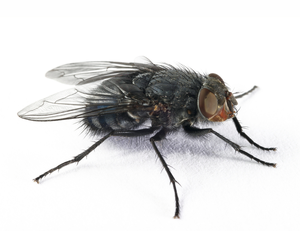

The purpose of this lesson is to explain the concept of **probability density** 
and **likelihood**, using a simple example of **Normal** probability density function.

***

For those with R studio, here are some optional code and libraries for interactive graphics:

```{r}
library(manipulate)

source("https://raw.githubusercontent.com/petrkeil/ML_and_Bayes_2017_iDiv/master/Univariate%20Normal%20Model/plotting_functions.r")
```

***

# The data

We will use data on **housefly wing length [mm]**, which you can find [here](http://www.seattlecentral.edu/qelp/sets/057/057.html). 

The original data are from Sokal & Hunter (1955) A morphometric analysis of DDT-resistant and non-resistant housefly strains *Ann. Entomol. Soc. Amer.* **48**: 499-507. 



To fetch the data directly from the web, run:
```{r}
wings <- read.table("http://goo.gl/4lPBG6", header=FALSE)[,1]*0.1
```

Let's examine the data:
```{r, fig.width=8, fig.height=4.5}
wings
par(mfrow=c(1,2))
hist(wings, freq=TRUE, col="grey", main="Frequency histogram")
points(wings, jitter(rep(0, times=100), factor=10))
hist(wings, freq=FALSE, col="grey", main="Density histogram")
points(wings, jitter(rep(0, times=100), factor=0.7))
```

***

# The Normal model

This is our formal model definition:

$$ p(x) = \frac{1}{\sqrt{2\pi}\sigma}e^{-(x-\mu)^2/(2\sigma^2)} $$

where $p()$ is **probability density function** (also known as PDF). The function has two parameters: $\mu$ (mean) and $\sigma$ (standard deviation).

For $\mu = 0$ and $\sigma = 1$ the model looks like this:
```{r, fig.width=4, fig.height=4}
  curve(dnorm, from=-4, to=4, ylab="p(x)")
```

***

**Remember:**

* Probability density is different from probability.

* Probability density is denoted by $p$, while probability is $P$.

* Probability density can be higher than 1.

* Probability density function must integrate to 1.

* *Probability distribution* is an ambiguous term.

***

# Fitting the model to the wing data

**KEY PROBLEM:** How do we decide which parametrization is the best for our data?

```{r, fig.width=12, fig.height=4, echo=FALSE}
  par(mfrow=c(1,4))
  curve(dnorm(x, mean=1, sd=1), from=2, to=6, ylab="p(x)", ylim=c(0, 0.6),
        main="mean=1, sd=1")
    points(wings, jitter(rep(0, 100), factor=0.2))
  curve(dnorm(x, mean=4, sd=2), from=2, to=6, ylab="p(x)", ylim=c(0, 0.6),
        main="mean=4, sd=2")
    points(wings, jitter(rep(0, 100), factor=0.2))
  curve(dnorm(x, mean=2, sd=3), from=2, to=6, ylab="p(x)", ylim=c(0, 0.6),
        main="mean=2, sd=3")
    points(wings, jitter(rep(0, 100), factor=0.2))
  curve(dnorm(x, mean=4.5, sd=0.7), from=2, to=6, ylab="p(x)", ylim=c(0, 0.6),
        main="mean=4.5, sd=0.7")
    points(wings, jitter(rep(0, 100), factor=0.2))
```

We can make this interactive using `manipulate`:

```{r, eval=FALSE}
manipulate(curve.data(mean, sd), 
           mean=slider(2, 7, step=0.01), 
           sd=slider(0.1,3, step=0.01, initial=1) )
```

***

## Likelihood - single data point

The *likelihood function* is the **density** evaluated at the data $x_1$, ... ,$x_n$, viewed as a function of model parameters ($\mu$ and $\sigma$ in case of the Normal model). We write it as $L(\mu, \sigma | x) = p(x | \mu, \sigma)$.  

**Calculation of likelihood in R is easy!** The R functions ```dnorm()```, ```dpois()```, ```dunif()```, ```dbinom()```, ```dgamma()```, ```dbeta()``` etc. are exactly for that!

**Example:** What is the likelihood of the first data value in the `wings` dataset,  given the $Normal(\mu=4, \sigma=1)$ model?

```{r}
my.mean = 4
my.sd = 1
```

Here is the data point that we will examine. Note that I use the letter
i to denote index:

```{r}
wings.i <- wings[1]
wings.i
```

Here is how you calculate the likelihood for the data point `wings.i` using
the function `dnorm`:
```{r}
L <- dnorm(x=wings.i, mean=my.mean, sd=my.sd)
L
```

Let's plot it:

```{r, echo=FALSE}
  curve(dnorm(x, my.mean, my.sd), from=0, to=7, 
        ylab="p(wings.i | mu, sigma)", xlab="wings",
        main=paste("p(wings.i | mu, sigma) = ", round(L, 4)))
  points(wings.i, 0)
  
  segments(x0=wings.i, y0=0, x1=wings.i, y1=L, col="red")
  segments(x0=-1, y0=L, x1=wings.i, y1=L, col="red")
```

You can try some interactive graphics:

```{r, eval=FALSE}
manipulate(curve.data.l.point(mean, sd, point),
           point = slider(1, length(wings)),
           mean=slider(2, 7, step=0.01), 
           sd=slider(0.1,3, step=0.01, initial=1) )
```

***

# Likelihood - whole dataset

Basic probability theory tells us that:

$$P(A \cap B) = P(A) \times P(B|A) = P(B) \times P(A|B) $$

Where $P(A \cap B)$ is **joint probability**, associated with *AND*, meaning
*"at the same time"*.

The problem is that joint probability for more than two events, 
e.g. $P( A \cap B \cap C \cap D )$, can be almost impossible to calculate, **with the exception of A and B being independent!** Then: 
$$P(A \cap B) = P(A) \times P(B) $$
and hence
$$ P( A \cap B \cap C \cap D ) = P(A) \times P(B) \times P(C) \times P(D)$$

It follows that it is useful to subject *probability density $p()$* to the same rules as *probability $P()$*. Hence, **we can calculate the likelihood of the whole dataset as a product of likelihoods of all individual data points!**

```{r}
  wings

  L <- dnorm(x=wings, mean=my.mean, sd=my.sd)
  L

  prod(L)
```
This is a ridiculously small number!
Which is why we have the **Negative Log Likelihood**:
```{r}
  - sum(log(L))
```

We can encapsulate it into a single function:
```{r}
  neg.LL.function <- function(x, mean, sd)
  {
    LL <- dnorm(x=x, mean=mean, sd=sd, log=TRUE) # note the log!!!
    neg.LL <- - sum(LL)
    return(neg.LL)
  }
```

It's a function of model parameters, so try to play around with different paramter values:

```{r}
  neg.LL.function(wings, mean=0, sd=1)
```

Negative log-likelihood can be then minimized (likelihood is maximized) in order to find the most likely model parameters - these are the **Maximum Likelihood Estimators (MLE)** of model parameters.

# Exercise

***

**Find and plot the MLE of the Normal model and the 'wings' data.** 

Use the following functions and scripts:

```{r, eval=FALSE}
 neg.LL.function()
 hist()
 curve()
```

You can try some interactive graphics:

```{r, eval=FALSE}
manipulate(curve.data.LL(mean, sd),
           mean=slider(2, 7, step=0.01), 
           sd=slider(0.1,3, step=0.01, initial=1) )

```

***

# Using ```optim()``` to find MLE

`optim` needs the `neg.LL.function` to take only one object, which can be
a vector (or a list). So I will just put all of the data into `dat` object,
and the parameters into `par` object.

```{r}
neg.LL.function.for.optim <- function(par, dat)
{
  LL <- dnorm(x=dat, mean=par[1], sd=par[2], log=TRUE) # note the log!!!
  neg.LL <- - sum(LL)
  return(neg.LL)
}
```

And run the actual optimization:
```{r}
optim(par=c(mean=0,var=1), 
      fn=neg.LL.function.for.optim, 
      dat=wings)
```

***

# Other functions derived from PDF

There are other functions derived from probability density function (PDF) `dnorm`:

- Cumulative distribution function (CDF) `pnorm`

- Quantile function `qnorm`

- Random number generator`rnorm`

Type `?pnorm`, `?qnorm` or `?rnorm` and check it out.

I have [a tutorial post](http://www.petrkeil.com/?p=2084) on that.


